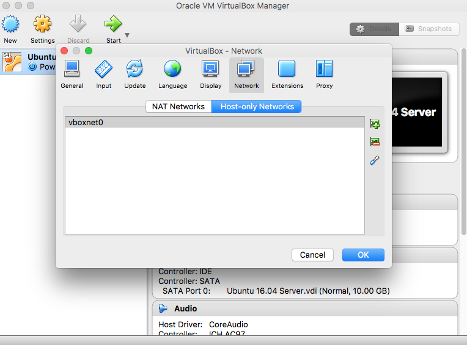
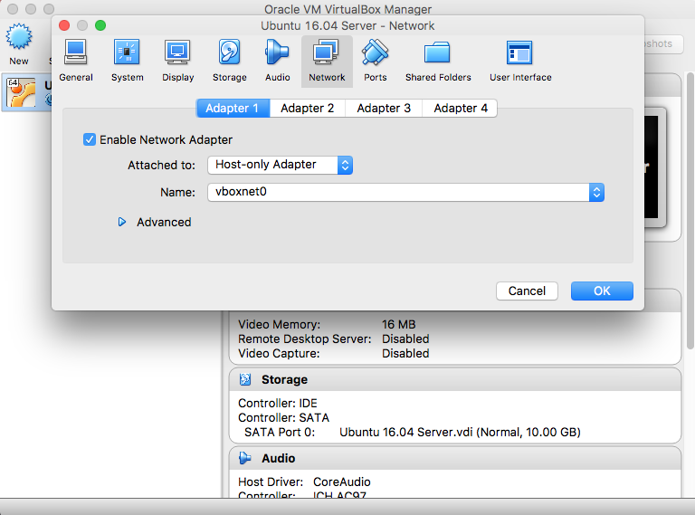

# Using the VirtualBox VM

The VM is a Ubuntu 16.04 instance with Elasticsearch, Kibana, and Logstash installed already.

## Install VirtualBox

Visit https://www.virtualbox.org/ and install VirtualBox on your system.

## Download the VM

http://files.tbops.co/badcamp2017/elk-ubuntu1604.ova

## Network Setup

If you are unfamiliar with how to access a VM from the host machine, then you will probably want to configure
VirtualBox accordingly.

We are going to create a Host-only network, and configure the VM to use it.

This will allow us to access the VM via SSH or the browser at `192.168.56.101`.

### VirtualBox Preferences

1. Launch VirtualBox
2. Go to the main preferences screen
3. Click `Network`
4. Click `Host-Only Networks`
5. If there are no entries, Click the `+` icon

You should end up with a new Host-only entry titled `vboxnet0`, or something similar.

### VM Preferences

Now to configure the VM to use the Host-only network.

With the VM powered down:

1. Click `Settings`
2. Click `Network`

You should be on the `Adapter 1` tab.

3. Make sure `Enable Network Adapter` is checked.
4. Select `Host-only Adapter` for the `Attached to` setting.
5. Select `vboxnet0` as the name.
6. Click `OK`

Now when you power on the VM, it should be accessible at IP: `192.168.56.101`.

You can try to access Kibana in your browser at: http://192.168.56.101:5601.

Troubleshooting:

If you cannot access the VM, run `ifconfig` in the console to determine what IP it has been assigned.

## Login

Username: `ubuntu`
Password: `ubuntu`

## Next Steps

Go to the main [README](../README.md) file and continue with the documentation for items that
do not indicate they are already done on the VM.
